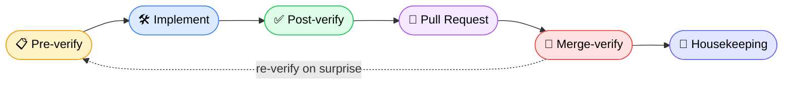

<div align="center">

# 🚢 `/ship`

### The verify-before-and-after workflow for Claude Code

*Every change — a typo or a migration — walks the same six phases, so nothing ships unverified.*

<br/>

[](https://docs.anthropic.com/en/docs/claude-code)
[](LICENSE)
[](https://github.com/haider0072/claude-standard-workflow/releases)
[](https://github.com/haider0072/claude-standard-workflow/pulls)

<br/>

```
/ship map candidate name field for the legacy payload
```

<br/>

**One command. Six phases. Zero "chhoti si change thi, verify ki zarurat nahi" outages.**

</div>

<br/>

---

## 💡 Why this exists

> The most expensive words in engineering: **_"it's a tiny change, no need to verify."_**

That single thought — skipping the check because the change *felt* small — is what causes the 3 AM pages, the silent deploy failures, the "how did this get to prod" incidents.

`/ship` makes that shortcut impossible. It turns hard-won engineering discipline into a **single, repeatable command** that any change flows through — a one-line typo and a database migration get the *same* rigor, just at different speeds.

<br/>

## ✨ What you get

<table>
<tr>
<td width="50%" valign="top">

### 🛑 Explain before you touch
Claude lists the files, callers, edge cases, and risks — then **waits for your confirmation** before writing a single line.

</td>
<td width="50%" valign="top">

### 🌳 Isolated worktrees
Every task runs in its own git worktree. Main branch stays clean, parallel work never collides.

</td>
</tr>
<tr>
<td width="50%" valign="top">

### 🔁 Backwards-compat by default
Touching data or schema? It forces the "what happens to existing rows?" question — before, not after.

</td>
<td width="50%" valign="top">

### ✅ Honest verification
CI-enforced tests, and a **`+0 new failures`** bar instead of the fantasy of "everything green."

</td>
</tr>
<tr>
<td width="50%" valign="top">

### 🚀 Post-merge proof
Merged ≠ shipped. Phase 5 confirms the deploy is actually **live and working** — catching silent failures.

</td>
<td width="50%" valign="top">

### 🧹 Leaves no mess
Records only genuine gotchas, prunes stale notes, tears down the worktree. Clean in, clean out.

</td>
</tr>
</table>

<br/>

## 🗺️ The pipeline



<div align="center">

`deep-analysis → plan → issue → pull → `**`worktree`**` → build → verify → PR → merge → deploy-retest → clean`

</div>

<br/>

## ⚡ Install

### Option A — Plugin _(recommended · one-line)_

Inside Claude Code:

```bash
/plugin marketplace add haider0072/claude-standard-workflow
/plugin install standard-workflow@standard-workflow-marketplace
```

That's it. Now run:

```bash
/ship <what you're changing>
```

> 🔄 **Update anytime:** `/plugin marketplace update standard-workflow-marketplace`

<br/>

### Option B — Single file _(no plugin system)_

<details>
<summary><b>Show manual install</b></summary>

<br/>

**Personal** — available in all your projects:

```bash
mkdir -p ~/.claude/commands
curl -o ~/.claude/commands/ship.md \
  https://raw.githubusercontent.com/haider0072/claude-standard-workflow/main/plugins/standard-workflow/commands/ship.md
```

**Per project** — commit it so your whole team gets it:

```bash
mkdir -p .claude/commands
curl -o .claude/commands/ship.md \
  https://raw.githubusercontent.com/haider0072/claude-standard-workflow/main/plugins/standard-workflow/commands/ship.md
git add .claude/commands/ship.md && git commit -m "chore: add /ship workflow command"
```

</details>

<br/>

## 🧭 The six phases

| # | Phase | What happens | The rule it enforces |
|:-:|-------|--------------|----------------------|
| **1** | 📋 **Pre-verify** | Map the change, callers, edge cases, negative impacts, backwards-compat | *Explain + estimate effort, then **wait for confirmation** before coding* |
| **2** | 🛠️ **Implement** | Smallest clean change, atomic conventional commits, migration-collision guard | *No scope creep. No "just in case" abstractions* |
| **3** | ✅ **Post-verify** | Tests · lint · build · manual smoke · self-review your own diff | *`+0 new failures`, enforced in **CI** — not honor-system* |
| **4** | 🔀 **Pull Request** | Summary · Context · Changes · Test plan · Risks · Rollback | *Self-review first — would **you** approve this?* |
| **5** | 🚀 **Merge-verify** | Confirm the deploy is live, health is green, the feature actually works | *Merged ≠ shipped. Catch silent deploy failures* |
| **6** | 🧹 **Housekeeping** | Record real gotchas, prune notes, remove the worktree | *Leave the campsite cleaner than you found it* |

<br/>

## 🎨 Make it yours

The entire workflow lives in **one Markdown file** → [`commands/ship.md`](plugins/standard-workflow/commands/ship.md)

Fork it, edit it, own it. Swap in your team's branch names, CI pipeline, environments, and conventions. No build step, no dependencies — it's just a prompt with really good taste.

<br/>

## 🤝 Contributing

Found a phase that could be sharper? A rule worth adding? PRs and issues are genuinely welcome — this is meant to be a living, community-improved workflow.

<br/>

## 📄 License

[MIT](LICENSE) — use it, fork it, ship with it.

<br/>

---

<div align="center">

**Built with discipline (and a little Roman Urdu) by [@haider0072](https://github.com/haider0072)**

<sub>⭐ If this saved you from a 3 AM page, drop a star.</sub>

</div>
